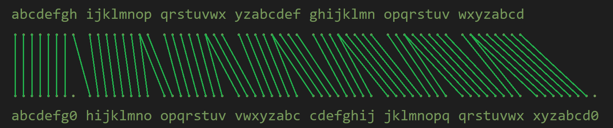

# LM and NTLM Hashes

## lm_hash
(PHP 5 >= 5.3.0, PHP 7, PHP 8)

lm_hash — Calculate the LM hash of a string

### Description
```php
lm_hash(string $input = '', bool $double = true): string
```

### Parameters
`input`

The user password to convert to an LM hash.

`double`

If the optional `double` is set to false, it will return a 16 byte hexadecimal string and only the first 7 bytes of input is used. If `double` is not specified or set to true then it will split the input into two chunks of 7 bytes and hash both and concatenate the two resulting hashes.

### Return Values
Returns a 16 or 32 hexadecimal string representing a 64- or 128-bit hash based on input.

### Algorithm Explained

In older Windows systems, the user password is typically stored as a 128-bit hash which is actually composed of two separate 64-bit LM hashes. These smaller hashes represent the first 7 bytes and second 7 bytes of the user password respectively. Password data beyond 14 bytes is ignored and the hash value remains at 128-bits.

If either chunk is smaller than 7 bytes, null bytes are appended to each string to ensure they are 7 bytes each.

All letters within the password undergo an uppercase operation while numbers and symbols remain unchanged. This effectively reduces the basic character set of the algorithm from 95 bytes to 69 bytes by excluding the use of the lowercase alphabet.

Each 7 bytes of the password gets prepared in order to be used as two DES keys. The preparation converts the 7 bytes (56 bits) of data into 8 bytes by bit-shifting and duplicating the use of some bits. The resulting data is not intended to be printable or useable for any other purpose than to be digested by the DES algorithm. The diagram below visually demonstrates the bit-shifting operations performed.


Each 8 bytes of the data gets passed to the DES algorithm as the key and a fixed string of `KGS!@#$%` is passed as the data to be encrypted by the key. The DES cipher mode is ECB. It isn't clear what KGS means but of course `!@#$%` are the keyboard shifted symbols for `12345` on a standard US keyboard (UK and other international keyboard layouts may vary). One theory is that KGS could mean "Key of Glen and Steve," the two authors of RFC 2433 (Microsoft PPP CHAP Extensions).

It is not yet known how the LM algorithm handles Unicode inputs.

## ntlm_hash
(PHP 5 >= 5.1.2, PHP 7, PHP 8)

ntlm_hash — Calculate the NTLM hash of a string

### Description

```php
ntlm_hash(string $input = ''): string
```

### Parameters
`input`

The user password to convert to an NTLM hash.

### Algorithm Explained

Like the LM hash, the NTLM hash is used on older Windows systems. It is stored as a 128-bit hash representing the user password. It is based solely on the MD4 algorithm after being converted from UTF-8 text encoding to UTF-16LE.
